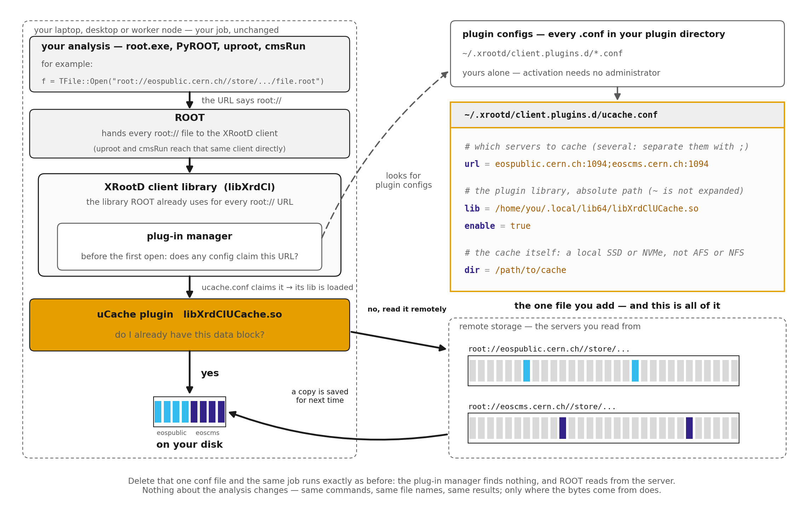

# uCache

xrd-ucache or simply uCache is a transparent, per-user read cache for
remote ROOT/XRootD data. You install it once and point it at the servers
you read from; thereafter every file your jobs read from them is cached
on local disk, so the **second and later** passes over the same data
come from that disk instead of the network. Nothing in your analysis
code changes and the first cold run has minimal overhead, so there's
little to lose in trying it.

[](https://arxiv.org/abs/2609.00400)

## How it works

uCache is a plug-in for the XRootD client — the library ROOT already uses for
every `root://` URL. Before your job opens its first file, that library's
plug-in manager reads the plugin configs in your home directory and asks
whether any of them claims the server in your URL. If `ucache.conf` does, the
manager loads the library it names, and from then on uCache answers that
file's reads: a data block already on your local disk is served from there,
anything else is fetched from the server and kept for next time.



Nothing about your analysis changes — same commands, same file names, same
results; only where the bytes come from. Delete that one config file and the
same job runs exactly as it did before.

An environment variable, `XRD_PLUGIN`, can take the config file's place: the
plug-in manager then loads the library it names for every server. That is the
quickest way to try uCache, below.

## Try it

No administrator needed: everything goes into `~/ucache` in your own account.
You need:

- **x86_64 Linux of the EL9 generation or newer.** Tested on AlmaLinux 9;
  the other EL9 systems (RHEL and Rocky 9, lxplus) are the same platform. The
  binaries need glibc 2.34 or newer, so EL8 and CentOS 7 cannot run them. EL10
  and other distributions that new are likely to work but are not tested.
- **ROOT that already reads `root://` files in your shell** — from lxplus, an
  LCG view, CMSSW or conda. uproot works too, through its XRootD bindings.

```sh
# 0. your ROOT can read root:// (prints "yes")
root-config --has-xrootd

# 1. get it: nothing written outside ~/ucache
mkdir -p ~/ucache
curl -L https://github.com/xrootd/xrd-ucache/releases/latest/download/xrd-ucache-el9-x86_64.tar.gz \
  | tar -xz -C ~/ucache --strip-components=1

# 2. switch it on, in this shell only
export PATH=$HOME/ucache/bin:$PATH
export XRD_PLUGIN=$HOME/ucache/lib64/libXrdClUCache.so
export UCACHE_DIR=/tmp/$USER/ucache        # fine for a try; see below for real use

# 3. check, then run your job twice
ucache doctor
ucache summary                              # after the second run
```

`doctor` names anything that would stop uCache from caching, and exits
non-zero if there is. Your job itself runs exactly as before: the first run
fills the cache, the second is served from it, and if anything goes wrong with
the cache a read falls back to the server rather than failing. For a measured
gain, run the job once more with `UCACHE_DISABLE=1`, which reads everything
from the server: uCache reports a gain only when it has measured one, and a
loss as a loss.

To switch it off, `unset XRD_PLUGIN`; to remove it,
`rm -rf ~/ucache /tmp/$USER/ucache`. The variables last only for this shell,
and while `XRD_PLUGIN` is set the XRootD client reads no plugin config file,
so any other client plugin configured on the machine is off.

## Using it for real

### Keep it on: one config file

A config file switches uCache on for every process you start, batch jobs
included, without any variables:

```sh
unset XRD_PLUGIN                                  # the file is not read while it is set
ucache setup --dir /path/on/a/local/disk/ucache   # writes ~/.xrootd/client.plugins.d/ucache.conf
ucache doctor
```

Keep `export PATH=$HOME/ucache/bin:$PATH` in your shell startup file for the
`ucache` command; the plugin itself needs nothing else. To switch uCache off,
`ucache disable`, or delete the file.

**Choose the disk with care.** It decides whether caching helps at all: on a
slow or network-backed volume a cache can be worse than reading the server.
Use a local SSD or NVMe, never AFS or NFS, and not a `/tmp` that the system
cleans. `ucache bench /path/to/candidate` measures a candidate in a few
minutes; [storage benchmarking](docs/BENCH.md) explains the result.

`setup` binds uCache to every server (`url = *`). To cache only some, name
them in the file: `url = eospublic.cern.ch;eoscms.cern.ch`. If you edit it by
hand, a `#` comment must start in the first column, and every value is taken
literally, with no `~` or `$HOME` expanded.

**Recompression (optional, off by default).** With `recompress = on` in the
file, a ROOT file compressed with LZMA or ZLIB is converted, the first time it
is read, into a form that is faster to decode, so later passes spend less time
unpacking. Before you turn it on:

> **Memory.** With it on, jobs hold more memory while they read. On the
> analyses measured, warm passes needed about 1.8x (TTree) and 2.3x (RNTuple)
> the memory the same job needs from a replica made by `ucache recompress`. If
> your jobs run short of memory, turn it off. Files already converted keep
> their layout until you remove them, while no job is reading them
> (`ucache untranspose <url>`, or `ucache clear`; a job still reading one
> would fail).

### Install for everyone on a machine: the RPM

An administrator can install uCache system-wide on EL9 (x86_64):

```sh
curl -LO https://github.com/xrootd/xrd-ucache/releases/latest/download/xrd-ucache-el9.x86_64.rpm
sudo dnf install ./xrd-ucache-el9.x86_64.rpm
```

It puts `ucache` in `/usr/bin` and the plugin in `/usr/lib64`, and requires no
XRootD package: the plugin runs inside whichever XRootD client a job uses. So
ROOT can come from the system (`sudo dnf install epel-release xrootd-client
root-netx`) or, for each user, from CVMFS, an LCG view or conda. Installing it
switches uCache on for nobody: each user does that as in "Try it", with
`XRD_PLUGIN=/usr/lib64/libXrdClUCache.so`, or with `ucache setup` above.

### macOS

> **Not published yet.** There are no prebuilt macOS binaries at the moment;
> until there are, build from source as the [user
> guide](docs/USER_GUIDE.md#build-from-source--macos) describes.

With them, trying it on an Apple silicon Mac takes the same three steps, with a
ROOT that reads `root://` (MacPorts `root6 +xrootd`, Homebrew, or conda):

```sh
root-config --has-xrootd                   # MacPorts names it root-config6
mkdir -p ~/ucache
curl -L https://github.com/xrootd/xrd-ucache/releases/latest/download/xrd-ucache-macos-arm64.tar.gz \
  | tar -xz -C ~/ucache --strip-components=1
export PATH=$HOME/ucache/bin:$PATH
export XRD_PLUGIN=$HOME/ucache/lib/libXrdClUCache.so
export UCACHE_DIR=$HOME/ucache-cache
ucache doctor
```

Download it with `curl`, as above, not with a web browser: macOS marks files a
browser downloads as quarantined, and the XRootD client then cannot load the
plugin, without saying so.

## Testing

The self-contained suites live here: unit, differential, crash-recovery, soak
and fuzz tests. CI builds them and runs `ctest` on Linux and macOS for every
change, along with 200 kill-9 crash-recovery iterations; a nightly job repeats
the differential at a million operations and the crash loop at a thousand.

The XRootD client plugin is built and fuzzed against a live origin on Linux
only. The macOS job stops short of it, so there the plugin is exercised by hand
rather than in CI.

Further validation is performed with tools outside this repository.

## Documentation

- [User guide](docs/USER_GUIDE.md) — install from the EL9 packages, or from
  source on Linux and macOS; activate, verify, configure, CLI reference
- [Cache management](docs/CACHE_MANAGEMENT.md) — space, eviction, choosing a
  cache disk
- [Troubleshooting](docs/TROUBLESHOOTING.md) — when it doesn't engage, or
  behaves oddly
- [Monitoring metrics](docs/STATS.md) — the numbers uCache records about your
  jobs, and the JSON files it writes
- [Storage benchmarking](docs/BENCH.md) — `ucache bench`: measuring a
  candidate cache directory, and why the choice matters
- [Publishing a measurement](docs/PUBLISH.md) — the optional `ucache publish`:
  what a report gives you, your identity string and where it lives, and the
  field-by-field statement of what leaves the machine. Nothing is published
  unless you run it
- [On-disk format](docs/FORMAT.md) — what a cached entry is made of on disk,
  for anyone inspecting or writing tooling against it

## Citing uCache

The design and its measurements are described in the paper
([arXiv:2609.00400](https://arxiv.org/abs/2609.00400)). If uCache is useful
in your work, please cite it:

```bibtex
@misc{kovalskyi2026ucache,
  title         = {Client-side transparent caching for remote {ROOT} data analysis},
  author        = {Kovalskyi, Dmytro and Eysermans, Jan and D'Alfonso, Mariarosaria and Paus, Christoph},
  year          = {2026},
  eprint        = {2609.00400},
  archivePrefix = {arXiv},
  primaryClass  = {cs.DC},
  doi           = {10.48550/arXiv.2609.00400},
  url           = {https://arxiv.org/abs/2609.00400}
}
```

## License

MIT License — see `LICENSE`. Copyright (c) 2026 Massachusetts Institute of
Technology. Author: Dmytro Kovalskyi (MIT).

## Development and AI assistance

Claude Code (Anthropic's agentic coding tool) was used in the development of
uCache and its documentation. The authors specified the requirements and
architecture, directed each change, and validated the implementation by its
measured behavior: unit, differential, crash-recovery and fuzz test suites run
under memory and race detectors; integration tests against real analysis
frameworks and storage services; and physics validation showing that cached and
direct analyses produce identical results at full dataset scale.

Individual commits carry no AI attribution. Its absence from the commit history
is a convention, not an omission.
